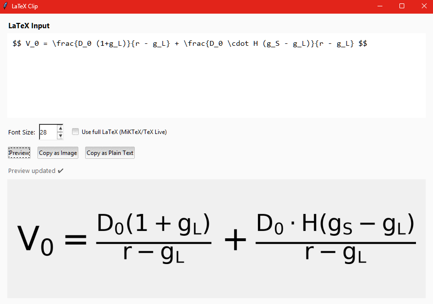
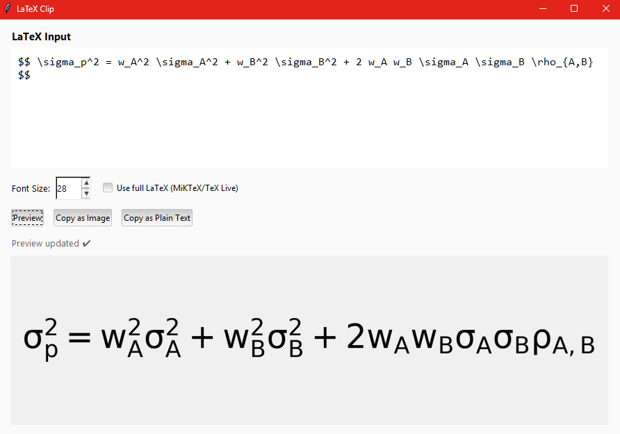

# LaTeX-to-Image Converter

This tool allows you to easily convert LaTeX equations into images. You can then paste these images into applications like Word, OneNote, or PowerPoint. It's especially useful for converting complex formulas you get from AI like ChatGPT, Gemini, or others, into a usable format for your documents and presentations. The tool also allows you to convert LaTeX into plain text and copy MathML/Office-ready markup directly for Equation editors.




## Quick Start (No Programming Knowledge Needed)

Follow these steps to get the tool running on your Windows computer.

### Step 1: Install Python

If you don't have Python, you need to install it first.

1.  Go to the official Python website: [python.org/downloads/windows](https://www.python.org/downloads/windows/)
2.  Download the latest stable version (e.g., Python 3.12).
3.  Run the installer. **Important:** On the first screen of the installer, make sure to check the box that says **"Add Python to PATH"**. This will make the next steps much easier.

### Step 2: Download This Tool

1.  Click the green **"Code"** button at the top of this page.
2.  Select **"Download ZIP"**.
3.  Extract the ZIP file to a folder you can easily find, for example, `C:\Users\YourUser\Documents\LatexTool`.

### Step 3: Install Required Libraries

1.  Open the **Command Prompt**. You can find it by searching for "cmd" in the Start Menu.
2.  Navigate to the folder where you extracted the tool. For example:
    ```cmd
    cd C:\Users\YourUser\Documents\LatexTool
    ```
3.  Install the necessary Python libraries by running this command:
    ```cmd
    pip install pillow matplotlib pywin32 latex2mathml
    ```
    *On non-Windows systems the `pywin32` dependency is optional and can be
    omitted. The `latex2mathml` library enables the new "Copy for Word/OneNote"
    button. If you do not need MathML clipboard support you may skip it.*

### Step 4: Run the Application

Now, you can run the tool. Simply double-click the `latexclip.py` file, or run it from the Command Prompt:

```cmd
python latexclip.py
```

The application window will open, and you can start converting your LaTeX. Use the **Copy for Word/OneNote** button to place MathML/HTML markup on the clipboard that pastes directly into Office equation editors. A live plain-text preview shows you what the simplified version will look like for documentation.

---

## Tips for Complex Formulas

The converter now understands alignment environments (`align`, `align*`, `gather`), structured pieces (`cases`), and matrix-style layouts when producing plain text. A few quick guidelines will help you get the best results:

* Use LaTeX text macros such as `\text{...}` or `\mathrm{...}` around multi-word labels so that both the Office-friendly output and the plain-text preview preserve your spacing.
* When building piecewise expressions, keep the standard `value , & condition` layout—LaTeX Clip rewrites this to human-friendly prose (for example `f(x) = (x^2 if x > 0; 0 otherwise)`).
* For matrices or arrays, feel free to include `\hline` separators. They are ignored in the plain-text rendering while the MathML/HTML clipboard still carries the full structure for Office.
* The preview collapses repeated whitespace automatically. If you need deliberate spacing in exported text, prefer explicit LaTeX spacing commands (`\,`, `\;`, `\quad`) or wrap the content in `\text{ }`.

---

## Optional Upgrades

### For Full, High-Quality LaTeX Rendering

The default mode uses a built-in renderer that is fast but may not support all complex LaTeX packages. For publication-quality rendering, you can install a full LaTeX distribution.

**1. Install a LaTeX Distribution**

You only need one of the following:

*   **MiKTeX (Recommended for Windows):** It's free and automatically downloads packages as you need them, saving space.
    *   [**Download MiKTeX**](https://miktex.org/download)

*   **TeX Live (Alternative):** A larger, more comprehensive distribution.
    *   [**Download TeX Live**](https://www.tug.org/texlive/acquire-netinstall.html)

**2. Install Ghostscript**

This is a required companion for the LaTeX distribution.

*   [**Download Ghostscript**](https://ghostscript.com/releases/gsdnld.html)
    *   Make sure the installer adds Ghostscript to your system's PATH (it usually does this by default).

Once installed, simply check the **"Use full LaTeX"** box in the app to enable high-quality rendering.

### Create a Standalone `.exe` Application

If you want to run this tool without needing to open Command Prompt, you can bundle it into a single `.exe` file.

**1. Install PyInstaller**

Open Command Prompt and run:

```cmd
pip install pyinstaller
```

**2. Create the Executable**

In the Command Prompt, navigate to the tool's directory and run the following command:

Use the bundled spec file so PyInstaller collects the themed assets and
matplotlib backends automatically:

```cmd
pyinstaller latexclip.spec
or
python -m PyInstaller --noconsole --onefile "latexclip.py"
```

After a few moments, you will find a `dist` folder. Inside, `latexclip.exe` is your standalone application. You can move this file anywhere on your computer or create a shortcut to it on your desktop.
